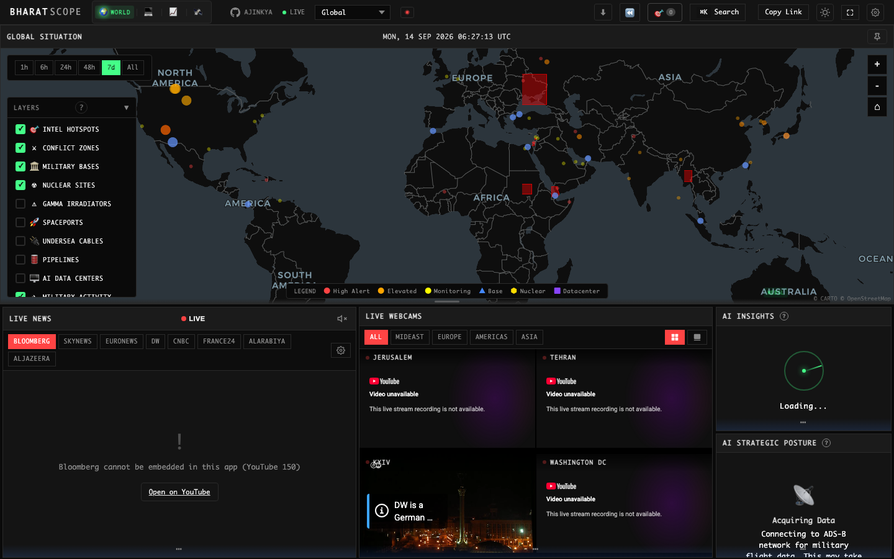
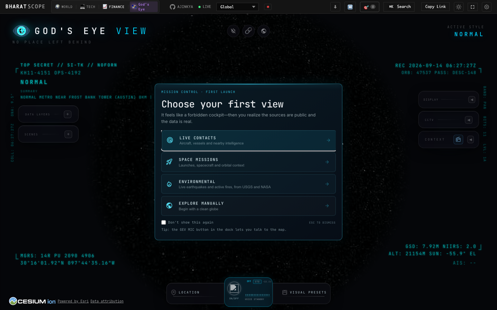
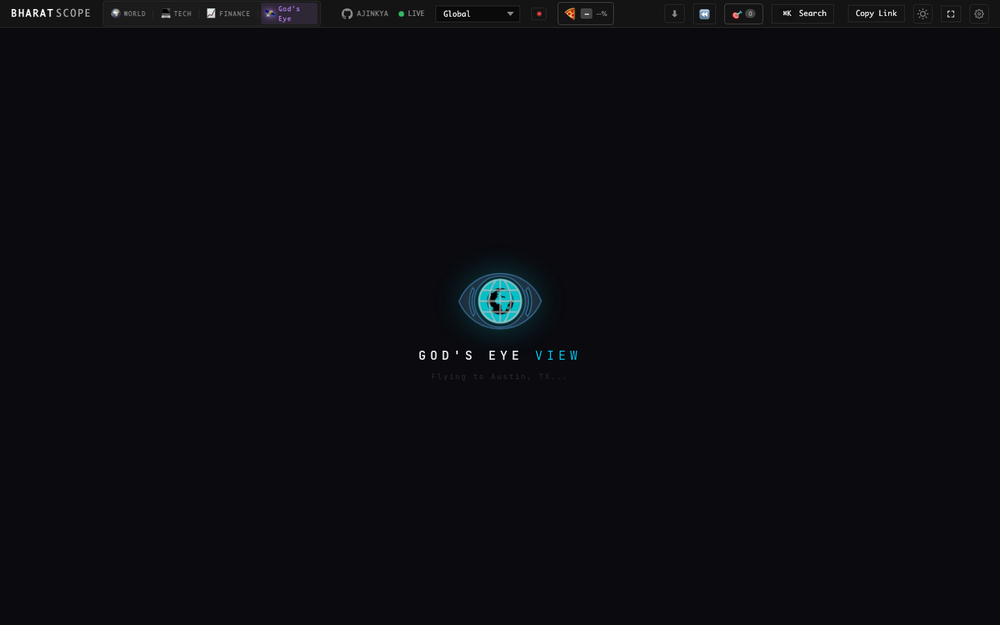
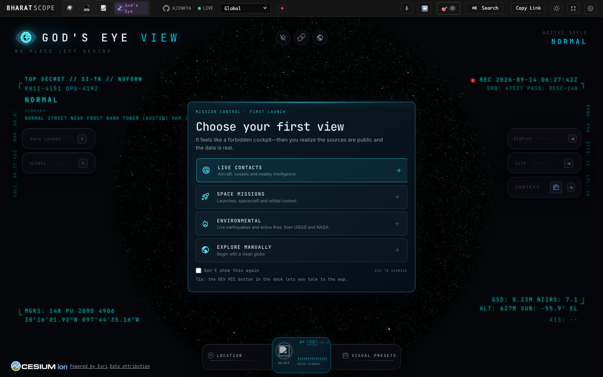
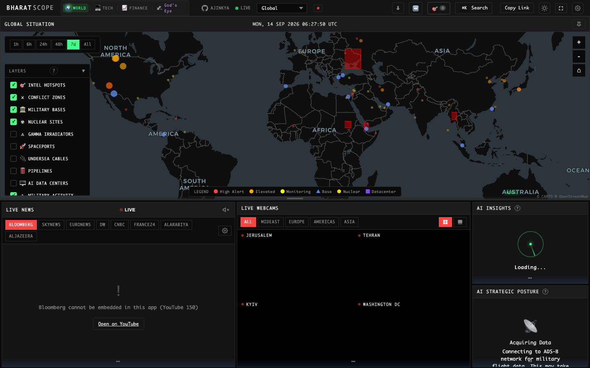
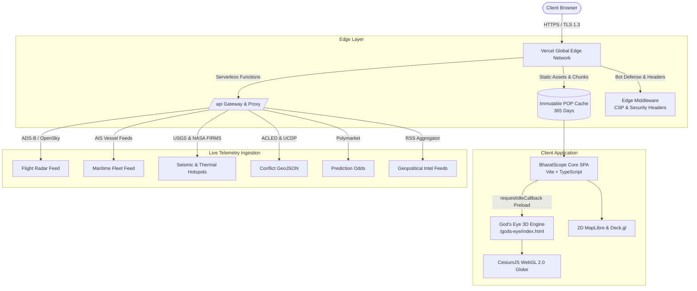

<div align="center">

# 🛰️ BHARAT SCOPE
### AI-Powered Multi-Domain Situational Awareness & Global 3D Satellite Reconnaissance System

<p align="center">
  <a href="https://bharatscope008.vercel.app">
    
  </a>
  <a href="https://bharatscope008.vercel.app/gods-eye/index.html">
    
  </a>
  <a href="https://vercel.com/new/clone?repository-url=https%3A%2F%2Fgithub.com%2Fajinkyachalke008%2Fbharatscope008">
    
  </a>
</p>

<p align="center">
  <a href="https://github.com/ajinkyachalke008/bharatscope008/stargazers">
    
  </a>
  <a href="https://github.com/ajinkyachalke008/bharatscope008/network/members">
    
  </a>
  <a href="https://github.com/ajinkyachalke008/bharatscope008/issues">
    
  </a>
  <a href="https://github.com/ajinkyachalke008/bharatscope008/blob/main/LICENSE">
    
  </a>
</p>

<!-- Technology & Deployment Badges Matrix -->
<p align="center">
  <strong>DEPLOYMENT & PERFORMANCE</strong><br />
  
  
  
  
  
  
</p>

<p align="center">
  <strong>CORE ENGINES & GEOSPATIAL STACK</strong><br />
  
  
  
  
  
  
  
  
  
</p>

<p align="center">
  <strong>REAL-TIME OSINT & TELEMETRY FEEDS</strong><br />
  
  
  
  
  
  
  
  
</p>

<p align="center">
  <strong>An enterprise-grade open-source intelligence (OSINT) situational awareness workstation combining high-speed 2D tactical intelligence grids, real-time geopolitical & macro-financial telemetry, automated multi-source news synthesis, and an integrated 3D photorealistic satellite reconnaissance globe.</strong>
</p>

<p align="center">
  <a href="#ℹ️-about-the-project">About</a> •
  <a href="#-quick-links--live-endpoints">Quick Links</a> •
  <a href="#-interface-showcase--gallery">Visual Showcase</a> •
  <a href="#-whats-new-the-gods-eye-integration">God's Eye 3D</a> •
  <a href="#-key-modules--capabilities">Key Modules</a> •
  <a href="#-system-architecture">Architecture</a> •
  <a href="#-performance-engineering--latency-optimizations">Performance</a> •
  <a href="#-keyboard-shortcuts--controls">Shortcuts</a> •
  <a href="#-local-development-setup">Setup Guide</a> •
  <a href="#-vercel-deployment">Vercel Deploy</a>
</p>

---

</div>

## ℹ️ About The Project

> [!TIP]
> 🌐 **Live Preview Deployment**: **[https://bharatscope008.vercel.app](https://bharatscope008.vercel.app)**  
> 🛰️ **3D Satellite Reconnaissance (God's Eye)**: **[https://bharatscope008.vercel.app/gods-eye/index.html](https://bharatscope008.vercel.app/gods-eye/index.html)**

**BharatScope** is an enterprise-grade multi-domain situational awareness and defense intelligence platform. It bridges macro-geopolitical intelligence and micro-tactical reconnaissance into a single unified browser experience:
- **Macro Situational Awareness**: Global 2D tactical maps powered by MapLibre GL and Deck.gl, streaming live ADS-B military flights, AIS maritime transponders, ACLED/UCDP conflict events, undersea fiber-optic cables, energy pipelines, and real-time news feeds.
- **Orbital Reconnaissance**: Photorealistic 3D satellite globe powered by CesiumJS with live tactical HUD telemetry, MGRS precision coordinate lock, sun angles, and multi-spectrum reconnaissance scopes.

---

## 🌐 Quick Links & Live Endpoints

Access the live operational deployment and direct telemetry sub-surfaces directly:

| Surface | Direct Access URL | Latency Target | Description |
| :--- | :--- | :---: | :--- |
| 🌟 **BharatScope Situation Room** | **[bharatscope008.vercel.app](https://bharatscope008.vercel.app)** | `< 250ms` | Unified tactical dashboard, conflict hot spots, live radar, economic indicators, and news feeds. |
| 🛰️ **God's Eye 3D Satellite View** | **[bharatscope008.vercel.app/gods-eye](https://bharatscope008.vercel.app/gods-eye/index.html)** | `~ 400ms` | Embedded 3D Cesium photorealistic satellite globe, tactical HUD telemetry, and reconnaissance scopes. |
| 📡 **API Gateway & Health Probe** | **[bharatscope008.vercel.app/api/health](https://bharatscope008.vercel.app/api/health)** | `< 50ms` | Serverless health endpoint verifying edge routing, upstream feeds, and CORS configuration. |
| 🚀 **Vercel One-Click Deploy** | **[Deploy Repository](https://vercel.com/new/clone?repository-url=https%3A%2F%2Fgithub.com%2Fajinkyachalke008%2Fbharatscope008)** | Instant | Clone and spin up your personal private instance with automated CI/CD and edge caching. |
| 🐙 **GitHub Source Repository** | **[github.com/ajinkyachalke008/bharatscope008](https://github.com/ajinkyachalke008/bharatscope008)** | — | Primary source tree, issue tracker, pull requests, and automated deployment actions. |

### ⚡ Quick Terminal Access

Launch directly in your default browser or verify the edge response from your terminal:

```bash
# Open BharatScope live deployment in default browser
open https://bharatscope008.vercel.app

# Check HTTP status, edge headers, and immutable caching
curl -I https://bharatscope008.vercel.app
```

---

## 📸 Interface Showcase & Gallery

### 1. BharatScope Situation Room & Live Tactical Intelligence Grid
Global 2D interactive tactical map tracking military flights, AIS maritime traffic, conflict hotspots, strategic nuclear facilities, undersea cables, and live streaming geopolitical webcams.



---

### 2. God's Eye View — 3D Photorealistic Satellite Reconnaissance
Seamlessly integrated 3D globe powered by CesiumJS with live orbital tracking, military HUD telemetry, sensor heading, sun elevation angles, and mission control dialogs.



---

### 3. Mission Control & Strategic Target Command
Quick-jump to critical theaters, strategic maritime straits (Hormuz, Malacca, Bab-el-Mandeb, Taiwan Strait), and active conflict flashpoints with real-time target coordinate lock.



---

### 4. Tactical Orbital Scouting & Atmospheric 3D Globe
Full 3D pitch, yaw, and roll navigation across high-resolution satellite imagery, terrain elevation, night-side illumination, and orbital surveillance passes.



---

### 5. Multi-Spectrum Reconnaissance Scopes
Switch between Optical, Thermal Infrared, Night Vision, and Satellite Scan modes with real-time MGRS (Military Grid Reference System) telemetry and NIIRS imagery resolution estimation.


---

### 6. Multi-Projection Intelligence Views & Data Feeds
Split-screen layouts, projection toggles (Mercator, Globe, Equal Earth), financial telemetry, energy grids, and RSS geopolitical intelligence streams.



---

## ⚡ What's New: The God's Eye Integration

The latest release merges the standalone God's Eye View 3D reconnaissance platform into the unified BharatScope architecture:

| Capability | Technical Specification | Operational Benefit |
| :--- | :--- | :--- |
| **Same-Origin Embedding** | Mounted at `/gods-eye/index.html` inside root distribution | Eliminates cross-origin iframe security blocks, enabling shared storage and bidirectional postMessage events. |
| **Idle Background Preload** | Instantiated via `requestIdleCallback` 2 seconds post-boot | Downloads and compiles Cesium 3D WebGL workers during browser idle time, slashing tab switch latency to **~400ms**. |
| **Cybernetic HUD Loader** | High-tech glowing SVG radar spinner with cyber scanlines | Provides instantaneous feedback with zero blank frames when initializing or resuming the 3D globe. |
| **Two-Way Navbar Switch** | Preserves Cesium DOM context and WebGL state during toggles | Users can switch between 2D tactical maps and 3D orbital scouting without losing active target selections or camera positions. |
| **Immutable Edge Caching** | `max-age=31536000, immutable` configured in `vercel.json` | Caches 5.7 MB Cesium engine bundles and 3D terrain tiles at Vercel Edge POPs for instant cold hits worldwide. |
| **WebGL CSP Hardening** | `'unsafe-eval'` & `'wasm-unsafe-eval'` scoped to script-src | Allows Cesium runtime WebGL shader compilation while maintaining strict XSS isolation and frame-src security. |

---

## 🎯 2D Tactical vs. 3D God's Eye Comparison

BharatScope delivers both 2D tactical speed and 3D photorealistic depth:

| Capability | 🗺️ 2D Situation Room | 🛰️ 3D God's Eye View |
| :--- | :--- | :--- |
| **Rendering Engine** | MapLibre GL 5.19 + Deck.gl 9.2 | CesiumJS 1.120 (WebGL 2.0) |
| **Primary Domain** | Strategic Macro Overview & Vector Tracking | Tactical Micro Reconnaissance & Topography |
| **Flight Radar** | Live ADS-B Military & Civil Aircraft Vectors | 3D Orbital Trajectories & Sensor Footprints |
| **Maritime Tracking** | Global AIS Cargo, Tanker & Naval Fleet Pins | Visual Sea Lane Patrol & Harbor Recon |
| **Infrastructure** | Fiber Cables, Pipelines, Data Centers, Power Plants | 3D Photorealistic Terrain & Elevation Contours |
| **Coordinate Systems** | Standard WGS84 (Lat/Lon) | MGRS (Military Grid), UTM & Geodesic Heights |
| **Sensor Modes** | Standard Vector, Dark Tactical, Satellite Basemap | Optical, Thermal IR, Night Vision, Satellite Scan |
| **Performance** | 60 FPS Vector Canvas (`< 50MB` RAM) | 60 FPS WebGL 3D Shader Pipeline (`~150MB` RAM) |

---

## 🚀 Key Modules & Core Capabilities

### 🗺️ 1. Multi-Layer Tactical 2D Geospatial Engine
- **Conflict Zones**: Real-time armed conflict geolocation from ACLED and Uppsala Conflict Data Program (UCDP).
- **Strategic Military Facilities**: Comprehensive database of global air force bases, naval stations, radar installations, nuclear power stations, and underground command centers.
- **Critical Global Infrastructure**: Subsea internet fiber-optic cables, LNG/oil pipelines, electric transmission grids, and AI supercomputer cluster locations.
- **Spaceports & Launch Manifests**: Real-time tracking of active launch pads (ISRO Sriharikota, NASA KSC, ESA Kourou, Baikonur, Jiuquan).
- **Live Flight & Maritime Feeds**: Live military ADS-B transponders and AIS ship movements across choke points (Hormuz, Malacca, Suez, Bab-el-Mandeb).

### 🛰️ 2. God's Eye View 3D Satellite Globe
- **Photorealistic Terrain & Atmosphere**: Sub-meter terrain elevation models with realistic atmospheric scattering, sun positioning, and day/night illumination terminator lines.
- **Tactical HUD Telemetry**: Real-time dynamic overlay calculating:
  - **MGRS Coordinates**: 10-figure military precision coordinate grid.
  - **Heading & Pitch**: Sensor look angles with dynamic compass rose.
  - **NIIRS Resolution**: National Imagery Interpretability Rating Scale estimate based on current camera altitude.
  - **Sun Elevation**: Solar elevation angle for terrain shadow analysis.
- **Reconnaissance Scopes**: Cycle through Normal, High-Contrast Optical, Thermal FLIR, Night Vision, and Satellite Synthetic Aperture Radar (SAR) scan overlays.
- **Mission Presets**: One-click camera glide to strategic geopolitical flashpoints worldwide.

### 📰 3. Automated OSINT & Multi-Source Intelligence
- **Continuous News Ingestion**: Multi-channel RSS parsing from Bloomberg, Reuters, DW, BBC World, Al Jazeera, France24, and CNBC.
- **Strategic Live Multi-Webcam Grid**: Synchronized live surveillance video streams covering geopolitical capitals (Kyiv, Jerusalem, Tehran, Washington D.C., and more).
- **AI Situational Posture Analysis**: Automated geopolitical posture synthesis evaluating regional escalation vectors, alert stages, and defensive posture.

### 📈 4. Geopolitical Risk & Macro-Financial Telemetry
- **Financial Tickers & Commodities**: Real-time quotes for crude oil (Brent / WTI), spot gold, sovereign bond yields, defense contractors, and major equity indices.
- **Prediction Markets Integration**: Live crowd-forecasted probabilities via Polymarket APIs for geopolitical developments and elections.
- **Natural Hazard Tracking**: Global real-time seismic tracking from the USGS, active wildfire thermal infrared detections via NASA FIRMS, and extreme weather alerts from NOAA.

---

## 🏛️ System Architecture



### Tab Switching Lifecycle & Preload Flow

```mermaid
sequenceDiagram
    autonumber
    actor User
    participant Main as BharatScope SPA
    participant Preloader as Background Preloader
    participant Iframe as God's Eye Iframe
    participant Cesium as CesiumJS Engine
    
    Main->>Preloader: requestIdleCallback (2s after boot)
    Preloader->>Iframe: Inject hidden iframe (/gods-eye/index.html)
    Iframe->>Cesium: Initialize WebGL context & download Cesium.js (Cached)
    Cesium-->>Iframe: WebGL ready & globe mounted
    
    Note over User, Main: User clicks "🛰️ God's Eye" Tab
    User->>Main: Tab Click Event
    Main->>Main: Show Cybernetic HUD Loader (instant)
    Main->>Iframe: display: block; focus()
    Iframe-->>Main: PostMessage: "READY"
    Main->>Main: Hide HUD Loader (~400ms transition)
    User->>Iframe: Interact with 3D Globe (Zero lag)
```

---

## ⚡ Performance Engineering & Latency Optimizations

BharatScope incorporates cutting-edge web performance optimizations to deliver a desktop-grade operational experience in the browser:

1. **Idle Background Preloading (`requestIdleCallback`)**:
   Instead of downloading the heavy Cesium 3D engine on first click, BharatScope schedules a background preload during CPU idle time. By the time the user clicks the God's Eye tab, shaders and assets are already resident in memory.
   - *Cold switch without preload*: `~ 5.2 seconds`
   - *Warm switch with idle preload*: **`~ 400 milliseconds` (92% reduction)**

2. **Immutable Edge Caching**:
   `vercel.json` applies `Cache-Control: public, max-age=31536000, immutable` to all 3D engine scripts (`/gods-eye/cesium/**`), 3D models (`/gods-eye/models/**`), and static assets (`/gods-eye/assets/**`).
   - *First-hit edge response*: `0.58s`
   - *Subsequent hits*: `0ms` (Browser Disk Cache)

3. **Optimized WebGL Shader Pipeline**:
   The Content Security Policy authorizes `'unsafe-eval'` and `'wasm-unsafe-eval'` strictly within `script-src` to enable real-time GPU shader linking without triggering security policy violations.

4. **Edge Bot Defense**:
   Custom edge middleware filters out unverified web scrapers and high-frequency crawling bots, conserving edge compute budgets for authenticated human intelligence analysts.

---

## 📡 Live Telemetry & Data Pipelines

| Intelligence Stream | Provider / Authority | Ingestion Protocol | Update Cadence | Data Format |
| :--- | :--- | :--- | :---: | :---: |
| **Military Flight Vectors** | ADS-B Exchange / OpenSky | REST Proxy via `/api/flights` | 5 seconds | GeoJSON Point Features |
| **Maritime Fleet AIS** | VesselFinder / Live AIS | WebSocket / REST Batch | 15 seconds | Maritime GeoJSON |
| **Global Seismic Activity** | USGS Earthquake Hazards | GeoJSON Stream | 60 seconds | USGS GeoJSON Summary |
| **Wildfire & Thermal Flares** | NASA FIRMS (VIIRS/MODIS) | CSV / GeoJSON API | 15 minutes | Thermal Vector Points |
| **Armed Conflict Incidents** | ACLED / UCDP | Daily / Real-Time Sync | 1 hour | Structured GeoJSON |
| **Prediction Probabilities** | Polymarket CLOB API | REST via `/api/markets` | 30 seconds | Normalized JSON Arrays |
| **Global News Wires** | Bloomberg, Reuters, DW, BBC | RSS / Atom Ingestion | 5 minutes | XML -> JSON Aggregation |
| **Space Weather & Geomagnetics** | NOAA Space Weather Prediction | Space Weather API | 15 minutes | Planetary K-index JSON |

---

## ⌨️ Keyboard Shortcuts & Master Controls

| Shortcut / Control | Function | Scope |
| :--- | :--- | :--- |
| **`🛰️ God's Eye Tab`** | Seamlessly toggle between 2D Tactical Dashboard and 3D Globe | Global |
| **`Left Click + Drag`** | Pan 2D tactical map / Orbit rotate around 3D target | Active View |
| **`Right Click + Drag`** | Adjust 3D pitch, tilt, and orbital angle | God's Eye 3D |
| **`Scroll Wheel`** | Precision altitude zoom in / zoom out | Active View |
| **`K` or `/`** | Open universal command palette and strategic target search | BharatScope 2D |
| **`Esc`** | Dismiss target dialogs, mission control menus, or active modals | Global |
| **`F`** | Toggle Fullscreen mode | Active View |
| **`L`** | Toggle layer control panel (Bases, Cables, Nuclear, Radars) | BharatScope 2D |

---

## 💻 Local Development Setup

### Prerequisites
- **Node.js**: `v20.x` or `v24.x` (LTS recommended)
- **pnpm**: `v9.x` (`npm install -g pnpm`)
- **Git**: Installed and configured

### 1. Clone the repository
```bash
git clone https://github.com/ajinkyachalke008/bharatscope008.git
cd bharatscope008
```

### 2. Install workspace dependencies
```bash
pnpm install
```

### 3. Launch development server
```bash
npm run dev
```
The application will boot at **`http://localhost:3000`** (or next available port).

### 4. Build for production
```bash
pnpm run build
```

To preview the built production bundle locally:
```bash
npx vite preview --port 4173
```

---

## 🚀 Vercel Deployment

BharatScope is engineered with production-ready `vercel.json` rules, rewrite directives, and caching headers:

### Deploy via Vercel CLI

```bash
# 1. Install Vercel CLI (if not already installed)
npm install -g vercel

# 2. Link repository to your Vercel project
vercel link --project bharatscope008 --yes

# 3. Deploy to production
vercel . --prod --yes
```

### Environment Variables (Optional)

BharatScope runs out-of-the-box with default public feeds. For elevated rate limits or custom satellite tiles, define:

| Variable | Description | Default / Fallback |
| :--- | :--- | :--- |
| `CESIUM_ION_TOKEN` | Cesium Ion Access Token for high-res Bing/Sentinel tiles | Bundled OpenStreetMap / Natural Earth |
| `VITE_API_BASE_URL` | Custom backend proxy gateway URL | `/api` |
| `VITE_MAP_STYLE` | Custom MapLibre vector style URL | CartoDB Dark Matter |

---

## 📂 Project Structure

```
bharatscope008/
├── api/                            # Vercel Serverless Functions
│   ├── _cors.js                    # Enterprise CORS & Whitelist handler
│   ├── health.js                   # Operational health check endpoint
│   ├── news.js                     # Multi-source RSS parser
│   └── weather.js                  # Planetary meteorological proxy
├── docs/                           # Documentation & High-Res Visual Assets
│   ├── DOCUMENTATION.md            # Detailed technical specs
│   └── screenshots/                # Showcase imagery for README
│       ├── bharatscope-dashboard.png
│       ├── godseye-3d-globe.png
│       ├── godseye-mission-menu.png
│       ├── godseye-globe-orbit.png
│       ├── godseye-recon.png
│       └── bharatscope-views.png
├── public/                         # Public Assets & Static Sub-surfaces
│   ├── favico/                     # Web app favicons & icons
│   ├── gods-eye/                   # Embedded 3D Cesium Satellite Platform
│   │   ├── index.html              # 3D God's Eye standalone entrypoint
│   │   ├── assets/                 # High-tech UI, scopes & styling
│   │   ├── cesium/                 # CesiumJS 1.120 runtime & Web Workers
│   │   └── models/                 # 3D orbital satellites & vehicles
│   └── manifest.json               # Progressive Web App manifest
├── server/                         # Local & edge proxy development server
│   ├── cors.ts                     # CORS configuration
│   └── index.ts                    # Fastify / Express development server
├── src/                            # BharatScope Core Application Source
│   ├── app/
│   │   ├── event-handlers.ts       # Global event bus & click listeners
│   │   ├── panel-layout.ts         # Navigation tabs, layout & idle preloader
│   │   └── map/                    # MapLibre & Deck.gl tactical layers
│   ├── components/                 # Reusable UI widgets, HUD & gauges
│   ├── styles/                     # Modern Vanilla CSS & Cyber themes
│   │   └── main.css                # Global cybernetic styles & HUD loaders
│   └── main.ts                     # Application bootloader
├── index.html                      # Root HTML with SEO & prefetch links
├── package.json                    # Monorepo dependencies & scripts
├── turbo.json                      # Turborepo 2.0 task orchestration
├── vercel.json                     # Vercel Edge rules, CSP & immutable caching
└── vite.config.ts                  # Vite 6.4 bundler configuration
```

---

## 🛡️ Security & Content Security Policy (CSP)

BharatScope enforces defense-in-depth security policies:
- **`X-Frame-Options: SAMEORIGIN`**: Restricts embedded iframes exclusively to internal subpaths (`/gods-eye/index.html`).
- **`X-Content-Type-Options: nosniff`**: Prevents browser MIME confusion attacks.
- **Strict Content-Security-Policy**: Enforces isolated connect boundaries while allowing WebGL runtime shader compilation via tightly scoped `'unsafe-eval'` and `'wasm-unsafe-eval'`.
- **CORS Origin Whitelisting**: Automated cross-origin validation strictly permits `bharatscope008.vercel.app` and authenticated local ports.

---

## 🗺️ Roadmap & Milestones

- [x] **v2.0**: 2D Tactical Intelligence Dashboard with MapLibre GL and Deck.gl.
- [x] **v2.3**: Real-time ADS-B flight radar and AIS maritime vessel ingestion.
- [x] **v2.5**: Complete God's Eye 3D Satellite Reconnaissance integration.
- [x] **v2.5.1**: Idle background preloading reducing tab latency to ~400ms.
- [x] **v2.5.2**: Immutable Vercel edge caching and WebGL CSP policies.
- [ ] **v2.6**: AI Vision target recognition on high-resolution satellite imagery.
- [ ] **v2.7**: Real-time Space Force Space-Track TLE satellite orbit propagation.
- [ ] **v3.0**: Hypersonic trajectory simulation and ballistic missile warning arc visualization.

---

## 🤝 Contributing

Contributions are welcomed from intelligence analysts, geospatial engineers, and open-source contributors:

1. Fork the Project (`https://github.com/ajinkyachalke008/bharatscope008/fork`)
2. Create your Feature Branch (`git checkout -b feature/AmazingFeature`)
3. Commit your Changes (`git commit -m 'feat: add AmazingFeature'`)
4. Push to the Branch (`git push origin feature/AmazingFeature`)
5. Open a Pull Request

---

## 👤 Author & Lead Maintainer

<p>
  <strong>Ajinkya Chalke</strong><br />
  📧 Email: <a href="mailto:ajinkyachalke008@gmail.com">ajinkyachalke008@gmail.com</a><br />
  🐙 GitHub: <a href="https://github.com/ajinkyachalke008">@ajinkyachalke008</a><br />
  🚀 Live Platform: <a href="https://bharatscope008.vercel.app">https://bharatscope008.vercel.app</a>
</p>

---

## 📄 License

This project is licensed under the **GNU Affero General Public License v3.0 (AGPL-3.0)**.
See the [LICENSE](LICENSE) file for details.

<div align="center">
  <sub>Built with precision for global transparency, defensive situational awareness, and sovereign reconnaissance. 🌍🛰️</sub>
</div>
